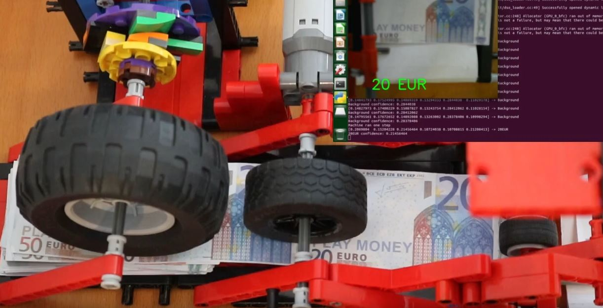

# Banknote Counter - Nvidia Jetson & Lego Technic 
Employing the Nvidia Jetson Nano for banknote classification and to control LEGO power functions' motors and servomotors to feed single notes for a money counting LEGO MOC.

Have a look at the video of final machine: https://youtu.be/MnLnOKctatg

## Nvidia Jetson Nano controlling LEGO Technic power functions motors and servomotors
A total of 4 motors and a servomotor are controlled by the Nvidia Jetson Nano. Therefore, a PCA9685 is connected to the Jetson Nano via I2C, offering 16 PWM (pulse-width modulation) channels. Two motor bridges (or H-bridges), more specifically two L293D chips, are used to drive the motors/servomotor with the 9V provided by the 9V Lego Power functions system and the PWM control channels of the PCA9685.  
A detailed video description of LEGO Power functions cable layout, PWM control of the motor/servomotor, etc. is given in the following:
- [LEGO Power Functions: Cable](https://youtu.be/tz1G_6vbO7Q)
- [LEGO Power Functions: Motor Control with PWM](https://youtu.be/gAPn_Jquxaw)
- [LEGO Power Functions: Servo Control with PWM](https://youtu.be/go4wQMvq7KU)
- [LEGO Power Functions: Control Motor/Servomotor via PCA9685](https://youtu.be/trT_Crm-CWE)
- [LEGO Power Functions: Employing the Jetson Nano to Control Motor/Servomotor via PCA9685](https://youtu.be/D2gSvXo0qT8)

## LEGO Technic Machine
In a nutshell, the servomotor is driving a first wheel using a overrunning or freewheel clutch. This first wheel pushes banknotes from a provides stack of notes. A first motor drives a second wheel which accelerates notes towards a third and final wheel. This wheel (driven by second motor) feeds single notes to a platform where a webcam (Logitec C270) is taking images from the note at the right time. A classification model inferes the type of bank note based on this input image. After the note is classfied a convey belt is used (third motor) to move the note out of the machine. Timing of the motor/servomotor control and the inference is done on the Jetson Nano. [Here's a video of final machine in action.](https://youtu.be/MnLnOKctatg)

## Training a Banknote Classifier
Six different classes (5, 10, 20, 50EUR, Background and Counterfeit Money) are defined and more than 500 images for each of the categories are taken und used for training. 
The training dataset is recorded under various lighting conditions, different backgrounds, angles and distances using the [camera capture tool](https://github.com/dusty-nv/jetson-inference/blob/master/docs/pytorch-collect.md) provided by the Nvidia AI hello world tools.  
The model was derived from a pretrained (ImageNet) VGG16 network, keeping the base model weights frozen.
Three dense layers (25,10,6) where stacked on top of the VGG16's final convolutional + maxpooling layers. 
A softmax layer is used after the last dense layer to estimate normalized confidences for each of the classes.  
For training all input images are converted to 60x60x3 and a batchsize of 5 is chosen, to allow training on the Jetson Nano hardware. Furthermore, the graphical mode is deactivated (sudo init 3) to free up additional GPU/CPU memory.  
During training the data is augmented using slight random rotations, contrast variation, zoom, and translations. Adam optimizer with a sparse categorical crossentropy loss is used.  
Tensorflow 2.x with Keras is used from model training with a 95/5% split of training and validation data set sizes. 
After around 10 epochs (roughly 1h per epoch) a training and validation accuracies of more than 80% are achived.  
An additional video documentation of the classifier training will be provided in the future. 

## Inference with the Banknote Classifier Model
The trained model is loaded and used for inference. Due to the fixed focus of the used webcam (Logitec C270) a compromise between banknote size and sharpness in the recorded images had to be found. As a result the camera was mounted on a hand crafted lego mount approx. 20cm above the convey belt. A better camera with variable focus and zoom will most probable increase the performance of such a setup.
An additional video documentation of inference examples will be provided in the future. 

